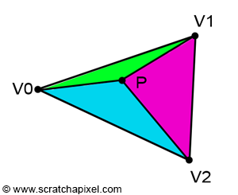
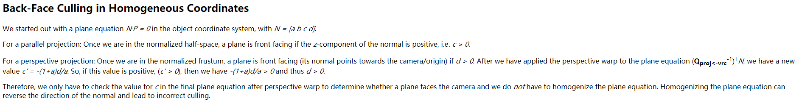
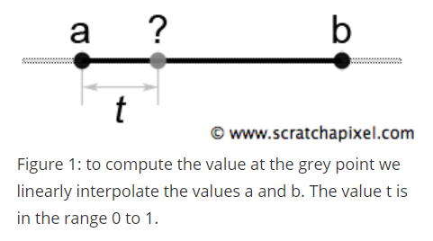

# SoftRenderer

## Bresenham画线法

原理是什么？百度出来的很多都没说或者解析清楚！

### 问题描述
  
假设小写的x,y为整数，大写的X,Y为浮点数

假设像素点(xi,yi)为直线上点(Xi,Yi)的最佳近似，并且xi = Xi(假设斜率m<1)。那么直线上下一个像素点可能为(xi+1, yi)或者(xi+1, yi+1)。

到底怎么选？

### 原理1: 距离比较法

**选择Y轴上与Y(i+1)距离最小的那个像素点。**

**结论部分：**

### 原理2: 误差法

### 参考
[Bresenham算法-维基解析](https://en.wikipedia.org/wiki/Bresenham%27s_line_algorithm)

[Bresenham算法1](https://blog.csdn.net/u012319493/article/details/53289132) 解析的还可以

[Bresenham算法2-误差法](https://blog.csdn.net/cjw_soledad/article/details/78886117)
[Bresenham算法-误差法2](http://www.cnblogs.com/gamesky/archive/2012/08/21/2648623.html)

[上面的不用看了，这个解析是最好的](https://blog.csdn.net/kakaxi2222/article/details/50708552?utm_source=copy)

## Cohen–Sutherland线段裁剪算法

问题描述：

**对线段裁剪使得它在指定的范围内**

>在绘制线段的时候，我们没法保证线段一定在窗口内部，这时候就需要对线段进行裁剪。

>首先对线段的两个端点按所在的区域进行分区编码，根据编码（bitmask）可以迅速地判明全部在窗口内的线段和全部在某边界外侧的线段。只有不属于这两种情况的线段，才需要求出线段与窗口边界的交点，求出交点后，舍去窗外部分。
>
>对剩余部分，把它作为新的线段看待，又从头开始考虑。两遍循环之后，就能确定该线段是部分截留下来，还是全部舍弃。

PS: 上面"两遍循环之后，就能确定"的说法不太对；因为如果像素在四个角的区域，例如1010，从算法实现上看，它既TOP又RIGHT，会被裁剪两遍，先TOP后RIGHT。

算法的关键是分区编码(其中0000为可视区域)

### 原理

### 参考

[Cohen–Sutherland算法](https://www.jianshu.com/p/d512116bbbf3)

## 三角形的栅格化
### 基于Scanline 算法的三角形填充

[TriangleRasterization](http://www.sunshine2k.de/coding/java/TriangleRasterization/TriangleRasterization.html)

把三角形进行拆分成平底和平顶三角形，分别按Y轴扫描线:

### 基于重心坐标插值的三角形栅格化

简单概括为：

遍历三角形的包围盒覆盖的像素点，判断该像素点是否属于三角形。而判断的方法是对于三角形内部的点有重心坐标 0<=λ0,λ1,λ2<=1；λ0+λ1+λ2 = 1。

对于可见性问题，即不同三角形的投影像素点重叠时，需要通过深度测试Depth-Buffer来取深度最小的(最接近摄像机)。

重心坐标同时还可用于插值像素的摄像机空间Z坐标以及颜色，纹理坐标等属性值。

#### 什么是重心坐标(barycentric coordinates)？

[Scratchapixel-Rasterization: a Practical Implementation](http://www.scratchapixel.com/lessons/3d-basic-rendering/rasterization-practical-implementation/rasterization-stage)

三角形内一点P的坐标可以表示为三个顶点的线性表达式：

其中对三角形内(包括边上)的点有：

λ012即是重心坐标。

#### 那么怎么求λ？

λ与该顶点的对边的子三角形的面积成正比：

求λ的关键是子三角形的面积，而面积可以通过**edge function**来求。

#### edge function

在顶点顺序为顺时针的情况下**(clockwise winding）**

假设(1)

在3维坐标系中，向量A和B的叉积等于A和B形成的平行四边形的面积。

对于2D的Area公式就是叉积自身：

代入假设(1)可得

    注意：在edge function判断一点在线段的左右时：
    在V0,V1, V2为顺时针时，对应的应该是判断A是否在B的右边为正；
    而不是figure6判断B是否在A的右边为正；
    结合后面顺序对edge方程左右的影响，这里应该是在V0，V1和V2为逆时针时的判断，因为逆时针时，三角形内部为负数。
    结合figure6和figure7的符号判断，总觉得figure6错了，红色的应该是B，蓝色的才是A，因为从上面的定义A是v0到P的向量，
    而figure7中是要判断P(也就是A)在B是否在B的右边；此时θ是顺时针从B到A的角度
    另外逆时针方向的

    
    应该写错了吧，跟原来的没有不同(等于原来的乘了两次-1）*

对三个子三角形分别有

即：

从而

同理可得λ1和λ2

::: alert-info

注意
上述顺时针和逆时针的公式的推到是基于Y轴向上的。而当在Screen Space使用EdgeFunction时，由于Y轴是向下的，所以EdgeFunction的符号刚好相反，也就是说在逆时针的顶点顺序下，使用按顺时针的公式就刚好为正。

即在Scene Space下，三角形$V_0V_1P$逆时针时下面公式为正。

:::

拳四郎的计算重点坐标的做法出自Real-Time Collision Detection这本书
[What's the most efficient way to find barycentric coordinates?
](https://gamedev.stackexchange.com/questions/23743/whats-the-most-efficient-way-to-find-barycentric-coordinates)

#### 参考

[重心座标插值(Barycentric Interpolation)](https://blog.csdn.net/silangquan/article/details/21990713)

[重心坐标](https://blog.csdn.net/xoyojank/article/details/5291348)

#### 深度Z的倒数是线性插值的

解决可见性问题的Depth-buffer算法需要点P的深度值， Z怎么求？

深度Z的倒数是线性插值的：

两个证明：

**[The Visibility Problem, the Depth Buffer Algorithm and Depth Interpolation](http://www.scratchapixel.com/lessons/3d-basic-rendering/rasterization-practical-implementation/visibility-problem-depth-buffer-depth-interpolation)**
>Why do we need to interpolate the vertices inverse z-coordinates?
>**Perspective projection preserves lines, but does not preserve distances**. 

[透视校正插值](http://www.cnblogs.com/mikewolf2002/archive/2012/11/25/2787480.html)

#### 透视校正插值(Perspective-Correct Interpolation)

[透视校正插值（Perspective-Correct Interpolation）](http://www.cnblogs.com/ArenAK/archive/2008/03/13/1103532.html)
> 因此对像素属性信息的插值不能是简单的线性，尤其是纹理坐标在用线性插值时会出现明显的失真。那么应该怎么办呢？方法就是如下的“透视校正插值”。
>  
> 关键 ：**顶点属性是与顶点的坐标值成线性关系**
> 
 >
>

[参考2-.scratchapixel证明](http://www.scratchapixel.com/lessons/3d-basic-rendering/rasterization-practical-implementation/perspective-correct-interpolation-vertex-attributes)

#### top-left rule 

当光栅化的三角形的边重叠时怎么处理？

实际中有什么用？

#### Fixed Point Coordinates

加速用: int类型的像素坐标，GPU计算的更快。

[fixed point](http://www.scratchapixel.com/lessons/3d-basic-rendering/rasterization-practical-implementation/rasterization-practical-implementation)

#### 像素中心坐标

由于像素坐标是浮点数：
约定：像素坐标从0开始，数值范围[i,i+1)属于像素i(即取整数部分)， 而次像素的中心坐标是i + 0.5;

所以计算像素(x,y)的重心坐标时，需要用该像素的中心位置坐标(x+0.5, y+0.5)

## 渲染管线

### OpenGL渲染管线

参照[OpenGL的渲染管线](https://www.khronos.org/opengl/wiki/Rendering_Pipeline_Overview)和之前自己写的[Unity从深度缓存反推世界坐标的正确姿势](https://leanote.com/note/58ddb7ccab644178dc006c16)，模型数据(三角形顶点数据)需要经过一系列处理最终在屏幕上呈现出来。

1. Vertex Specification: 指定几何对象的属性结构等
    - Vertex Rendering: 指定好几何对象之后就可以使用各种Draw指令来渲染它 

 2. Vertex Processing
    - Vertex shader: 顶点着色器;
    如果没有下面两个可选的，那么需要在Vertex Shader中完成vertex从model space到clip space的转换，通过
    
    $$ P_{clip} = mul(MVP,P_{model})  $$
    - Tessellation: 曲面细分;可选的;(Unity没有)
    - Geometry Shader: 几何着色器;可选的;(Unity也没有)
    它的输入输出是几何体(Primitive)那是不是代表在它之前跑多了一次类似Primitive Assembly的过程??
 
 3. Vertex Shader的输出将被送进固定的Vertex post-processing管线，依次进行
    - Transform Feedback:可选的，输出到Buffer
    
    - Clipping: CVV裁剪，其中CVV的范围是
  
    $$
    -w_{clip} \leq x_{clip} \leq w_{clip} \\
    -w_{clip} \leq y_{clip} \leq w_{clip} \\
    -w_{clip} \leq z_{clip} \leq w_{clip}
    $$
    并且在Depth clamping被打开的时候，上述$w_{clip}$的裁剪将不会进行！
    
    - Perspective divide: 透视除法，转换到NDC space
   
    $$
    P_{ndc} = \frac{P_{clip}}{w_{clip}}\\
    \text 其中w_{clip} = - z_{eye}
    $$
    
    - Viewport transform: 视口变换
   
    $$
    \begin{pmatrix} x_{screen} \\ y_{screen} \\ z_{screen} \end{pmatrix} = \begin{pmatrix} (x_{ndc}+1)*(\frac{width}{2}) + x  \\ (y_{ndc}+1)*(\frac{height}{2}) + y \\ \frac{farVal-nearVal}{2}*z_{ndc} + \frac{farVal+nearVal}{2} \end{pmatrix} \\
    $$
    其中width,height分别是窗口的深度和宽度;
    x和y分别是窗口左下角的坐标，默认为(0,0);
    上述的单位都是像素。
    而farVal和nearVal则分别是n和f对应的屏幕深度值，初始为(0,1)。
    **用于深度测试的和写入 深度缓存的就是这个$z_{screen}$**

 4. Primitive assembly: 图元装配
 
 5. Face culling: 背面剔除/正面剔除/不剔除
 
 6. Rasterization: 光栅化; 
 输出片元: 只有screen space坐标是必须包含的; 其他数据如颜色和贴图UV等是可选的。

 7. Fragment Processing: Fragment Shader片元着色器;可选的;
 输出
    - fragment color: 片元颜色;可在Fragment Shader赋值
    - depth: 深度值;可在Fragment Shader赋值，但一般不设置，直接输出输入的screen space深度值;
    **这个depth值最终将会写入深度缓存**
    - stencil: 用于stencil test;不可在Fragment Shader赋值
    
 8. Per-Sample Operations: 一系列的固定步骤
    - Pixel ownership Test: 测试像素是否被其他窗口遮挡
    - Scissor Test: 剪裁测试; 是否在定义的screen范围内
    - Stencil Test: 模板测试
    - Depth Test: 深度测试
    - *AlphaTest:* OpenGL文档没有，但Unity有；具体执行顺序不确定，先放在这
    - Blending: 对应Unity里的Alpha Blending
 最后片元颜色将被写入到framebuffer。

渲染管线是参考[OpenGL-Vertex_Post-Processing](https://www.khronos.org/opengl/wiki/Vertex_Post-Processing)。

>**注意:**
>Depth Clamping: 是OpenGL中的，不知道DX中有没有，并且没看懂有啥用[ARB_depth_clamp](https://www.khronos.org/registry/OpenGL/extensions/ARB/ARB_depth_clamp.txt)；需要进一步google!//TODO

> **注意:**
>在Unity中，vertex在Vertex Shader中被语义绑定为POSITION，而在Fragment Shader中被语义绑定为SV_POSITION，才会进行Vertex Post Processing。

### MVP 变换

在顶点着色器中需要把输入顶点的齐次坐标从Model Space变换到Clip Space：

$$ P_{clip} = mul(MVP,P_{model})  $$

其中M，V，P的公式分别是：

注意： **[row major和column major的矩阵可以通过取transpose来转换](http://www.scratchapixel.com/lessons/mathematics-physics-for-computer-graphics/geometry/row-major-vs-column-major-vector)**

下面如果没有明确说，都是row major的

- Model Matrix:  [Real-Time Rendering (2) - 变换和矩阵（Transforms and Matrics）](https://blog.csdn.net/silangquan/article/details/9970673)

**column major的公式**

    - 平移变换

    
    - 旋转矩阵
 
 
 > 注意：注意旋转的顺序。先绕X轴旋转角度a，再绕Y轴旋转角度b的结果，不等于先绕Y轴旋转角度b，在绕X轴旋转a的结果。
 > [Note that the order of rotation is important and makes a difference. If you rotate a point around the x-axis first and then the y-axis second, you will end up (in most cases) with a result which is different from a rotation around the y-axis then around the x-axis.](http://www.scratchapixel.com/lessons/mathematics-physics-for-computer-graphics/geometry/how-does-matrix-work-part-1)

 注意
 
- [**OpenGL中的顺序是Z->Y->X**](http://www.songho.ca/opengl/gl_matrix.html)

PS: OpenGL默认是column major

 
 - [**Unity的顺序是Z->X->Y**](https://docs.unity3d.com/ScriptReference/Quaternion-eulerAngles.html)
 - [**C#Numerics和DirectX的顺序应该是Z-X-Y**](https://docs.microsoft.com/zh-cn/dotnet/api/system.numerics.quaternion.createfromyawpitchroll?view=netframework-4.7.2#System_Numerics_Quaternion_CreateFromYawPitchRoll_System_Single_System_Single_System_Single_)

- 
 
 不要被函数参数的顺序误导了[D3DXMatrixRotationYawPitchRoll function](https://docs.microsoft.com/zh-cn/windows/desktop/direct3d9/d3dxmatrixrotationyawpitchroll)
 
 
    - 缩放矩阵

那么ModelToWorld就是$M = TRS$,注意在column major下顺序一定是T*R*S，因为

>[This transformation can be stated in words as “first scale, then rotate, then translate”. ](https://www.3dgep.com/understanding-the-view-matrix/)

那么在row major下，取其transpose，即是 $M = SRT$

- View Matrix: 相机自身可以表示为平移和旋转变换$C = TR$，该变换从相机坐标系转换到世界坐标系。那么V从世界坐标系转换到视口坐标系，就是该变换的逆变换。

$$
V = C^{-1} = R^{-1} * T^{-1}
$$

上述公式为column major

注意：**上述公式为Camera Space基于左手坐标系，变换到右手坐标系需要逆转Z轴**

还有两种求View矩阵的方法

    - Look At Camera
    
    [Placing a Camera: the LookAt Function](http://www.scratchapixel.com/lessons/mathematics-physics-for-computer-graphics/lookat-function) row major的公式

    注意：下述程序的Camera Space是基于右手坐标系
    

    - FPS like Yaw & Pitch

--------------------------

- Projection Matrix: [The OpenGL Perspective Projection Matrix](http://www.scratchapixel.com/lessons/3d-basic-rendering/perspective-and-orthographic-projection-matrix/opengl-perspective-projection-matrix)

row major的公式：

关于Z-Fighting:
//TODO

其他参考
- [OpenGL Matrix Class](http://www.songho.ca/opengl/gl_matrix.html)
- [How Does Matrix Work: Part 1](http://www.scratchapixel.com/lessons/mathematics-physics-for-computer-graphics/geometry/how-does-matrix-work-part-1)

::: alert-info
注意: **本实现中向量使用row major；z轴在ndc的范围为[-1,1]; camera space基于右手坐标系，其他基于左右坐标系**
:::

#### 四元数

旋转用XYZ三个轴的旋转矩阵分别相乘容易有[gimbal lock(万向锁)](https://www.cnblogs.com/psklf/p/5656938.html)的问题

其中旋转还可以用四元数来处理：[彻底搞懂四元数](https://blog.csdn.net/silangquan/article/details/39008903)

##### 四元数转旋转矩阵

[三维旋转：欧拉角、四元数、旋转矩阵、轴角之间的转换](https://zhuanlan.zhihu.com/p/45404840)

注意矩阵是column-major的

另有[维基公式](https://en.wikipedia.org/wiki/Quaternions_and_spatial_rotation)

##### 四元数和欧拉角

###### 欧拉角转四元数

把三个基础旋转Elemental Rotation组合在一起

###### 四元数转欧拉角

- OpenGL的Roll -> Yaw -> Pitch(即Z->Y->X)的公式 

- Unity和DirectX的Roll -> Pitch-> Yaw(即Z->X->Y)的

[三维旋转：欧拉角、四元数、旋转矩阵、轴角之间的转换](https://zhuanlan.zhihu.com/p/45404840)从四元数到变换矩阵到欧拉角的思路做转换。

代入四元数column-major的矩阵可得

$$

α = atan2(2(xz+yw),1-2(x^2+y^2)) \\
β = arcsin(2(xw-yz)) \\
γ = atan2(2(xy+zw),1-2(x^2+z^2))

$$

还需要处理Gimbal Lock的位置，也就是 $β= \pm\ \frac {π} {2}$的时候：

其中$sin(β) = -m_{23} = 2(xw-yz)$；且Unity的习惯是让γ为0，算α的值。

*找到的资料要不就是不是按Roll -> Pitch-> Yaw的顺序，要不就是Roll -> Pitch-> Yaw对应Z->X->Y轴;例如维基是Z轴朝上，Y轴朝右，X轴往外(右手坐标系)；只有上面的合用*

- [四元数与欧拉角（RPY角）的相互转换公式](https://www.cnblogs.com/21207-iHome/p/6894128.html) 的RPY顺序对了，但是ZXY对应不上；不过它的证明方法可以参考下

**α,β,γ分别是Y轴，X轴，Z轴的角度**

注意他的Z-Y-X不是指OpenGL的顺序，这是因为这个人用的是Z轴朝上，Y轴朝右，跟一般的习惯相反。所以实际是Unity里的Z-X-Y。

或者通过RPY的顺序也能说明，Roll都是Z轴；Pitch他是Y轴，我们是X轴；Yaw他是X轴，我们是Y轴

-------------------

[DirectX四元素与欧拉角之间的转换](https://blog.csdn.net/yinxingtianxia/article/details/53465365) 里面最后的Direct3D的对应关系没说清楚，应该是φ对应Z轴，θ对应Y轴，ψ对应X轴

另视频：[四元数的可视化](https://www.bilibili.com/video/av33385105?from=search&seid=2148761343479718092)和[四元数和三维转动](https://www.bilibili.com/video/av35804287)

- $q_{a}*q_{b}$:四元数$q_{a}$乘以四元数$q_{b}$其实看作（1）对$q_{a}$进行$q_{b}$左旋转，或者（2）对$q_{b}$进行$q_{a}$右旋转 [四元数（转自知乎）](https://www.cnblogs.com/hjlweilong/p/6018746.html)

- [Understanding Quaternions](https://www.3dgep.com/understanding-quaternions/)
- [Understanding Quaternions 中文翻译《理解四元数》](https://www.qiujiawei.com/understanding-quaternions/)
- [如何形象地理解四元数？ - 知乎](https://www.zhihu.com/question/23005815/answer/483589712)

### 补充

#### 对法线的转换需要使用M矩阵的逆转置矩阵

从模型坐标系到世界坐标系：
为什么对顶点的变换可以直接使用_Object2World，而 对法线的转换需要使用矩阵的逆转置矩阵
(但是在模型坐标系的三个基是正交的情况下, 矩阵的你转置矩阵等于它自身)

[法线从object space到eye space的转换((normal matrix)](http://www.cnblogs.com/flytrace/p/3379816.html)

[Normals and the Inverse Transpose, Part 1: Grassmann Algebra](http://reedbeta.com/blog/normals-inverse-transpose-part-1/)

#### Z-Fighting

深度缓存的精度不够，遮挡判断的误差使得初选重叠。

并且浮点数的精度大部分用在了n裁剪平面附近

一般解决方法：[Z-fighting:Wiki](https://en.wikipedia.org/wiki/Z-fighting):
1.使用更大精度的Z-buffer
2. 减少n和f之间的距离;或者让n尽可能的大
3. 在渲染的时候加一个screen space z-buffer offset，只影响深度测试
4. 使用logarithmic Z-buffer, reversing Z：也就是远裁剪平面投影到0 ;由于浮点数编码方式使得在0附近有更大的精度，(GTA V在用,Direct11也是)
5. 超过一定距离的物体，放在不超过安全距离的地方渲染，并相应的把它缩小；

[Depth Precision Visualized](http://reedbeta.com/blog/depth-precision-visualized/)对不同小数格式的depth-buffer(interger或者floating-point)，不同n和f对深度缓存d的影响。

##### The Effects of Roundoff Error
Z-Fighting还有可能由算数误差引起，对此建议：

这可能是Unity在Shaderlab中把P和MV矩阵分开的原因;另外reversed-Z效果非常好：**the reversed-Z mapping is basically magic.**
//TODO

[使用Polygon Offset解决Z-fighting和stitching](https://blog.csdn.net/oglmatrix/article/details/1793074)

[Z-fighting:OpenGL](https://learnopengl.com/Advanced-OpenGL/Depth-testing)

[How to understand Z-Fighting?](https://computergraphics.stackexchange.com/questions/4429/how-to-understand-z-fighting)

## Hidden-surface determination

### Backface culling

定义顺时针(clockwise)或者逆时针(counter-clockwise)的三角形顶点顺序是前面。**一般用逆时针**,如Unity和[OpenGL](https://www.khronos.org/opengl/wiki/Face_Culling)。

两种方法：[Backface culling](http://glasnost.itcarlow.ie/~powerk/GeneralGraphicsNotes/HSR/backfaceculling.html)

    1. 通过上面的EdgeFunction计算的三角形Area面积的正负号。注意由于Scene Space的Y轴是向下的，上文公式(基于Y轴向上推到的)的正负号应该是反过来才对。
    2. 求摄像机到三角形上某一点的向量与三角形法线的夹角。
    
    当$n * (e − q )<0$时，为背面。(注意下图中e->q的箭头和该公式画反了)
    
 

注意[求法线n](https://en.wikipedia.org/wiki/Back-face_culling)时顶点顺序对它方向的影响。

由于EdgeFuntion之前已经实现过了，所以用方法1，在Screen Space做。

OpenGL中Face Culling是在Primitive assembly中做的，也就是Perspective Divide 和 Viewport Transform之后，光栅化之前；也就是说在Screen Space做的;Nvdia的[Life of a triangle - NVIDIA's logical pipeline](https://developer.nvidia.com/content/life-triangle-nvidias-logical-pipeline)也是说在Raster Engine做back-face culling。

但感觉有点后了，能不能提前在Clip Space(或者更前的Camera Space)做？，少个透视除法和插值？(有人跟我有类似的想法[front end culling](http://www.gamasutra.com/view/feature/131773/a_compact_method_for_backface_.php?print=1))

先说结论(自己想的，也不一定对)：

在Clip Space是Back face的，在Screen Space一定是Back face；但在Screen Space是Back face的，在Clip Space不一定是Back face；而Back face是由Screen Space的顺序定义的，所以说Clip Space做背面剔除可以，但是不完全，有些被遮挡的没被剔除。

因为主要是透视除法的影响，当深度Z越大，透视除法后X或Y轴趋向于0，也就是屏幕的中心，可能会使得点的相对位置变化。

假设逆时针是Front face，假设$V_0$，$V_1$，$V_2$在Clip Space是逆时针(在Camera Space也是逆时针的，由于Projection Matrix在透视除法前是线性的，相对位置不变)，$V_2$在$V_0$和$V_1$的右边；假如$V_2$的深度Z不断变大，那么$V_2$在Screen Space的投影会往屏幕中间靠拢，就有可能会变成在$V_0$和$V_1$的左边，此时$V_0$，$V_1$，$V_2$在Screen Space是顺时针的；其实这一部分在Camera Space看来是逆时针的，但由于透视的原因，被前面遮挡住的部分，会被深度测试剔除掉。同理可证，顺时针为Front Face时。

感觉作为优化在Clip Space还是可以做，如果这个三角形被剔除掉了，可以省了CVV的Clipping和透视除法，视口变换等；但是在Screen Space还要做一次，可以减少被遮挡的三角形被光栅化。

上面是基于方法1，基于Area来做时会有的问题；后来仔细想想，如果基于方法2，基于向量夹角来做，在Clip Space做不会出现问题?

测试发现在Clip Space用向量夹角来做是错的，会更快的把三角面剔除掉。而在其他人的代码里在View Space做是没问题的。为什么Clip Space做有问题？
奇怪的是不用z_Clip而用w_Clip做向量的z坐标又是对的？

**感觉用Area做Back-face Culling位置应该还是在NDC或者ViewPort ;如果用向量夹角做，Back-face Culling的位置应该放在Eye Space**

补充:

1 [Back-Face Culling in Homogeneous Coordinates](https://people.eecs.berkeley.edu/~ug/slide/pipeline/assignments/as6/discussion.shtml#cull)有另外一种Clip Space做Culling的方法

**2 怎么求向量叉积得到的法线的方向？**

[wiki](https://en.wikipedia.org/wiki/Cross_product)里说可以基于右手法则

但从下文看，应该是有条件的，这是基于右手坐标系

所以对于左手坐标系应该有左手法则？

---------------------------------------------

### Clipping

#### 那为什么裁剪不在透视除法后的NDC Space做？
Clip Space的CVV由于$V_0$，$V_1$，$V_2$的$w_0$，$w_1$，$w_2$各不相同，不是一个规则的形状，那为什么裁剪不在透视除法后的NDC Space做？

这是因为透视变换Projection是线性的，而透视除法不是线性的，如果**在透视除法后做，将不能直接用线性插值**，许多在原来坐标系中的信息将会变形。而又由于齐次空间上的点与它在$w=1$的平面上的投影存在对应的关系(?)，所以可以用齐次坐标来进行裁剪。参考[齐次空间的裁剪-为什么不在投影除法后裁剪](https://blog.csdn.net/softwarekid/article/details/45055253)

还有个可能是可能$w<0$(对于摄像机后的点)，会出现这种情况:

-w < x < w can be false while -1 < x/w < 1 is true

#### 为什么在Clip Space做和再NDC Space做一样？

感觉在回答为什么[ it doesn't make any difference whether clipping happens before or after the perspective divide](https://stackoverflow.com/questions/42060860/opengl-sutherland-hodgman-polygon-clipping-algorithm-in-homogeneous-coordinates)时，这个证明更好。

#### 怎么定义裁剪平面和线性插值
也就是说，在Clip Space的裁剪实际是在四维空间(**齐次空间**)做的，在NDC的规范化立方体是$-1 \leq x_{ndc},y_{ndc},z_{ndc} \leq 1$。
以X轴举例，$x_{ndc} = \frac{x_{clip}}{w_{clip}}$，即$-w_{clip} \leq x_{clip} \leq w_{clip}$。那么Clip Space左裁剪平面就是$x = -w$，也就是$x+w = 0$。

由于" dot product of a point and a vector is the distance that point is along the vector"，该平面可以定义为满足下列条件的点的集合：

$$
P * (1,0,0,1) = (x,y,z,w) * (1,0,0,1) = x+w = 0
$$

其中最后的1可看做是距离，前三项(1,0,0)特意选的该平面的法线方向，使得: 对任意一点P，如果距离$P*Clip < 0$，则该点在裁剪体外；当$P*Clip >0$时在裁剪体内；或者可以这样理解，如果为正代表沿着法线的方向，为负代表与法线方向相反。

又名[Hesse normal form](https://en.wikipedia.org/wiki/Hesse_normal_form)

并且对于点A和B，可以通过线性插值的方式，求通过它们的直线与裁剪平面的交点C。

$$
A * (1,0,0,1) = A_{a} \\
B * (1,0,0,1) = B_{a} \\
\frac{A_{a}}{A_{a}-B_{b}} = C_{a} \\
A*(1 - C_{a}) + B * (C_{a}) = C
$$
同理，6个裁剪面分别是

$$
X_{left} = (1,0,0,1) \\
X_{right} = (-1,0,0,1) \\
Y_{top} = (0,-1,0,1) \\
Y_{bottom} = (0,1,0,1) \\
Z_{near} = (0,0,1,1) \\
Z_{far} = (0,0,-1,1)
$$

上面推倒参考自[3D Clipping in Homogeneous Coordinates.](https://www.tuicool.com/articles/bMBnIbu)

#### Sutherland-Hodgman 算法

在有了裁剪平面和插值方法的基础上，可以Sutherland-Hodgman Clipping算法进行裁剪。

算法的基础是基于单个平面裁剪多边形(It is important to realize that splitting a shape with a plane is a fundamental tool in this clipping routine.)

Sutherland-Hodgman主要是处理Line Loops的裁剪，能够处理多边形，(WaveFrontObj用到的Triangle Fan也是一种Line Loop)。而我们只需要处理最简单的一种，三角形面片。
它的输入是多边形的顶点列表和一个或多个裁剪平面组成的裁剪体，而输出的多边形顶点列表全都在裁剪体内部。如

上一次单个平面的裁剪结果作为下一个的输入，多个裁剪平面依次作用

算法的伪代码如下：

上面伪代码最后一个else if错了
与下面的说明没对上

应该是 else if startingPoint behind and endPoint in front  clippingPlane

还是看[wiki的伪代码](https://en.wikipedia.org/wiki/Sutherland%E2%80%93Hodgman_algorithm)

和这个说明[polygon clipping之Sutherland-Hodgman Algorithm](https://blog.csdn.net/llwszjj/article/details/24841863)

::: alert-info
注意：
至于[3D Clipping in Homogeneous Coordinates.](https://chaosinmotion.blog/2016/05/22/3d-clipping-in-homogeneous-coordinates/)的公式与上面的不太一样；文中远裁剪平面中的w = 0是怎么来的？

一般来说near和far在NDC Space中Z是[-1,1]或者[0,1]，而这个作者的是[-1,0]是因为他用了不同的Projection矩阵，并且他没有用far，或者说把far推到武器远。

在他的[Goodbye Far Clipping Plane.](https://chaosinmotion.blog/2010/09/06/goodbye-far-clipping-plane/)中说，当far很大或者比值far/near很大的情况下，当NDC space的z值趋向于1时(或者其他非0的数值)，深度z基于IEEE754的单或者双精度浮点数表示，由于浮点数的精度误差问题（由于小数部分只有23位或者53位），将使得$Z_{ndc}$对应的$Z_{clip}$出现非常大(等于自己)的误差。

而当浮点数趋向于0时，指数位可以缩减，将使得可以用更多(全部)的位来做小数部分，可以获得更小的误差（误差递减特性)。
所以区别于传统的OpenGL的Projection Maxtrix使得Z在near和far分别趋向于[-1,1];他提出了新的Projection Matrix使得near和far=-∞分别趋向于[-1,0]，也就是说不要far裁剪平面，或者说far裁剪平面在无穷远;从而使得z非常大时，不会由于浮点数的深度的精度问题出现前后关系不对的误差。

上面这个跟Z-Fighting的处理的关系？

在这里也提出了类似的Trick[Projection Matrix Tricks](http://www.terathon.com/gdc07_lengyel.pdf)

*但为什么拳四郎用的是普通的Projection矩阵，却用的是w=0的近平面？*

:::

#### 参考

[Why clipping should be done in CCS, not NDCS](https://stackoverflow.com/questions/41952225/why-clipping-should-be-done-in-ccs-not-ndcs#)

[**polygon clipping之Sutherland-Hodgman Algorithm**](https://blog.csdn.net/llwszjj/article/details/24841863)

[**Understanding Sutherland-Hodgman Clipping for Physics Engines**](https://gamedevelopment.tutsplus.com/tutorials/understanding-sutherland-hodgman-clipping-for-physics-engines--gamedev-11917)

[OpenGL sutherland-hodgman polygon clipping algorithm in homogeneous coordinates (4D, CCS)](https://stackoverflow.com/questions/42060860/opengl-sutherland-hodgman-polygon-clipping-algorithm-in-homogeneous-coordinates)

[Clipping in Homogeneous Coordinates](https://people.eecs.berkeley.edu/~ug/slide/pipeline/assignments/as6/discussion.shtml#clip)

[Clipping using homogeneous coordinates](https://dl.acm.org/citation.cfm?id=807398)

注:

[3D Clipping in Homogeneous Coordinates.](https://www.tuicool.com/articles/bMBnIbu)该文只是一个画线的算法不是一个画三角形的方法，画三角形需要用[Sutherland–Hodgman algorithm](https://en.wikipedia.org/wiki/Sutherland%E2%80%93Hodgman_algorithm)

# 纹理采样

怎么获得纹理坐标$0 \le u,v \le 1$的采样结果。
首先分别乘以纹理的宽和高

$$
U = u * width \\
V = v * height
$$

对于UV一般有三种方法：点采样，双线性采样，三线性采样

## 点采样

最简单的情况，对于UV，直接取整$U = Round(U), V = Round(V)$，结果就是纹理像素(U,V)对应的颜色值，只要采样一个像素的颜色。

## 双线性采样

基于线性插值，先看一维的线性插值

$$
a(1-t)+bt \quad with \quad 0 \le t \le 1
$$

那么对于UV分别使用线性插值就是双线性插值：

最终结果是

需要采样四个像素的颜色。

## 三线性采样

三线性采样可以看做是两个双线性采样(e和f)的线性插值

需要在front face和back face分别采样4个，总共8个像素。其中front face和back face代表不同的mipmap层级。

三线性采样的第三个纹理坐标是怎么定的？

https://blog.csdn.net/puppet_master/article/details/50187291

https://stackoverflow.com/questions/24388346/how-to-access-automatic-mipmap-level-in-glsl-fragment-shader-texture

Texture Magnification 这个好像在Realtime Rendering 3rd里见过？

------------------------------------------------------------------

# 总参考

[如何写一个软渲染](https://zhuanlan.zhihu.com/p/43586784)

[C#实现](https://blog.csdn.net/aceyan0718/article/details/51659381)

[Scratchapixel 2.0](http://www.scratchapixel.com/index.php?redirect)

[How to write a simple software rasterizer](http://www.cnblogs.com/hust-ruan/archive/2013/03/16/2962077.html)

[Life of a triangle - NVIDIA's logical pipeline](https://developer.nvidia.com/content/life-triangle-nvidias-logical-pipeline)
